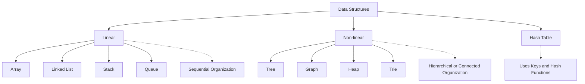

# 1. What is a data structure?

* approach of storing data in a computre so that it can be accessed efficiently.
* for example, 100 student names could be stored in an array [...] instead of to separate 100 vars

## Typical data structures

* Linear
  * Array
  * Linked List
  * Stack
  * Queue

* Non-linear
  * Tree
  * Graph
  * Heap
  * Trie

* Hash Table

## 1.1 Linear data structures

### Array

Data structure in which elements are stored in an ordered sequence.

Examples:
* list of names
* list of numbers
* product prices

### Linked list

Data structure in which an element (node) and a reference to the next element (node) are stored.

Examples:
* Dynamic sequences
* Some memory structures ?

### Stack

Data structure in which last element added is the first element removed.

Follows **LIFO - Last In, First Out.**

Examples:
* undo operations
* function calls
* browser history

### Queue

Data structure in which the first element is the first removed.

Follows **FIFO - First In, First Out**

Examples: 
* Printer jobs
* Task scheduling
* Customer service queues.

_

